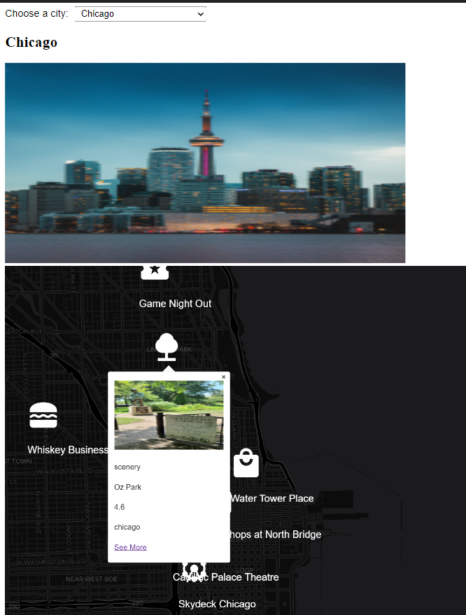

# Peak (Work in Progress)   
#### Make fun plans based on your location and explore different ways to enjoy your life

**Stack:** *Angular (SASS) and Firestore*

#### **Objective 📈:** **Create an exciting web application that scales and pushes your creativity**

**Requirements** 🚦

• *Must create 3 major feature sections that continuously builds on top of its own foundation*

• *Must have authenticated users with specific privileges and a followers feed feature*

• *Must have secure firestore/firebase rules and must manage data effectively (caching api calls between pages, filtering data through rxjs and use subjects, etc)*

&nbsp;

# Roadmap 📜

## Explore Hub 1 🌌

*Filtering Data*

&emsp; &emsp;• Filter events based on price

&emsp; &emsp;• Filter between individual activities or compound activities

&emsp; &emsp;• Filter by generalized or personalized plans/events

&emsp; &emsp;• Filter by outdoors or indoor activities

&emsp; &emsp;• Filter by time of year (winter vs summer)

## Nearby Hub 2 🌌

*Show a Data visualization of how busy each place gets*

Display different location icons on the map. (Don’t display info unless tapped) ✅

Allow users to change the map style ✅

*Allow users to check in to places + track how often a user has visited a place*

*Get commute estimates based on your location*

*Check the distance and est time between different locations*

*Add a UI menu at the bottom of the map view to see:*

&emsp; &emsp;• What's closest to someone (refreshes as you move over the map)

&emsp; &emsp;• Or view your only favorite places

*Random place spinner. Randomly select a place to visit. You can also use this feature with your favorites*

## Profile Hub 3 🌌

*Save plan ideas in your “future fun” profile section*

*See how often you visited a place* 

*See places you recently visited*

*Choose your preferences and set a budget*

*Add upcoming activities section. This will show plans near you*

*Allow someone to sign up for activities. Put them in a section for them to see. Maybe personal page*

&emsp; &emsp;

# Current Problems 😎

### Major - None

• **(May 19, 2022): Limitation Feature: Check distance between locations**

&emsp; &emsp; It's funny a simple distance line isn't possible within maplibre-gl's library. The lines' inputs only include init methods and this is why lines can't be dynamically created and displayed immediately on the map. The lines can only update if the entire map refreshes. I figured this out after switching 
the map between night and morning mode. Withinthe first 2 attempts, a map view service variable was used. Since it isn't possible, I will have to use an alternative solution. 

 >Attempt 1: Geometry 
  <mgl-geojson-source id="oneline"><mgl-feature *ngIf="checkDistance" [geometry]="checkDistance"></mgl-feature></mgl-geojson-source>
  <mgl-layer id="route" type="line" source="oneline" [layout]="{'line-join': 'round','line-cap': 'round'}" [paint]="{'line-color': '#888','line-width': 8}"></mgl-layer>

  this.checkDistance = {  type: 'LineString' as const, coordinates: [[pointLat1, pointLong1],[pointLat2, pointLong2],],}}

  >Attempt 2: Source
  <mgl-layer id="LineString" type="line" [source]="source" [paint]="{'line-color': '#BF93E4','line-width': 5}" [layout]="{'line-join': 'round','line-cap': 'round'}" ></mgl-layer>
  this.checkDistance = {type: 'geojson',data: {type: 'FeatureCollection',features: [{type: 'Feature',geometry: {type: 'LineString',properties: {},coordinates: <[number, number][]>[[0, 0],[107, 38],]}}]}}

  >Attempt 3: Force Map Rerender
  @ViewChild("mapper") mapp!: Map;
  this.mapp._render

  

### Minor

• **(Apr 21, 2022): simplified comp and fixed out of sync city issue  commit: 116aab1e6ca1b9a2ad03f6a1071ede2f3e25c3d9**

&emsp; &emsp;When breaking down the logic in the nearby comp, I had a lot of trouble updating the map and displaying images from the user's selection. 
I tried using multiple variations of input/output functions and using NgOnChanges but these attempts didn't work because I needed
to use a setter to make API calls from new input values. This was the drawback with input/output.

> Allowing API calls through inputed values
  @Input sent(value: any) {
     if (value !== undefined || '') {
       this._apiResponse = value.toLowerCase(); 
      }
  }
  
🔑*Allow inefficiencies to guide you. Realizing this, fixed everything. The user selection should've been in the parent (view map) because it controls everything. If I want to see new city activities, I'd toggle the user selection. This structure change allowed the city data to stay in sync and allow me to update the explore page in future.

&nbsp;

*Limitations 📜:*

>Maplibre Geocoder API isn't compatible with Angular

  https://github.com/maplibre/maplibre-gl-geocoder

*📚 Sources:*

> Distance Calculation from 2 Geographic Coordinates (as seen in the map view service)

  https://www.geeksforgeeks.org/program-distance-two-points-earth/

> API Ideas 

  *Here Reverse Geocoding:*
  https://platform.here.com/portal/

  Possible Alt Uses: Real time weather forecasts, search autocomplete

  *Mass Profile Account Bots*
  https://fakerjs.dev/

  *QR Menu/Website Scanner for Sites*
  https://www.qrtag.net/api/

  *Find stuff to do*
  https://www.boredapi.com/

  *Free Geocoding APIS*
  https://ipbase.com/
  https://geocode.xyz/api
  https://geokeo.com/
  https://www.geojs.io/
  https://onwater.io/ - On Water. Could prevent Home from being set in Water

  *Find APIS//Possible Ideas* (? = maybeNot)
  • Check how busy a place is
  • Transit routing
  • Restaurant reviews
  • ?Art gallery experience section? - https://api.artic.edu/docs/#best-practices 
  • Schedule/Calendars - https://quickchart.io/
  • Random Food Ideas for Dinner - https://foodish-api.herokuapp.com/
  • Find breweries/drinks - https://www.openbrewerydb.org/documentation#random-brewery
  • ?Social situations tester? - https://excuser.herokuapp.com/ + Advices Quotes (Maybe a daily thing when logged in) https://api.adviceslip.com/, http://forismatic.com/en/api/, https://api.goprogram.ai/inspiration/docs/

  • User Reviews of new Products (maybe connect multiple videos to an article to show opinions on food) - https://github.com/andyklimczak/TheReportOfTheWeek-API
  • Universities near you - https://github.com/Hipo/university-domains-list
  • Quality of Life conditions - https://developers.teleport.org/
  • Live aircrafts - https://www.adsbexchange.com/data/
